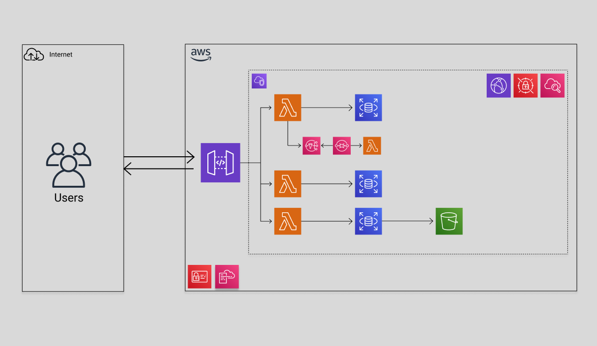

# Trocar API

Trocar is a platform that facilitates the exchange of goods and services between neighboring users. Our platform aims to create a collaborative community where users can easily exchange objects and services, promoting reuse, recycling and waste reduction.

## Backend Architecture

## Tech Stack

**Server:** Typescript, Node.js, Express framework, PostgreSQL, Prisma ORM, Docker ( run locally DB ), CDK AWS, SDK AWS, Jest